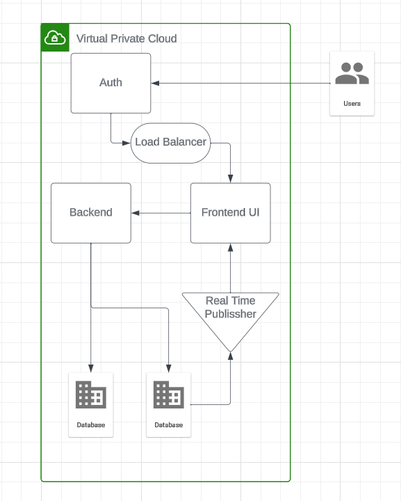

# Week 0 — Billing and Architecture

## Architecture?
### Requrements: 
- THings a project must MUST achive. Can be technical or business. They should be:
    - verifiable
    - moniterable
    - traceable
    - feasable
- Risks, Assumptions and Constraints affect Requitements.
- Risks - what can prevent project from being completed.
- Asumptions - factors that are held as true for planning.
- Constraints - policy or technical limitatios of the project.

## Design
- It is layered in such a way that you start at really high level with conceptual design and zoom in to Logical design and then Physical design

- Conceptual design: basic high level design, just napkin design
- Logical Design: defines how system should be implemented, env without names or sizes
- Physical Design: Representation of how thing is to be built

> It it important to develop common dictionalry 
> To do that, ask Dumb questions, it sets stage for deep dive questions
> Play 'Be the Packet' to understand the system in detail.
> Documnet everything.

## Conceptual Design

